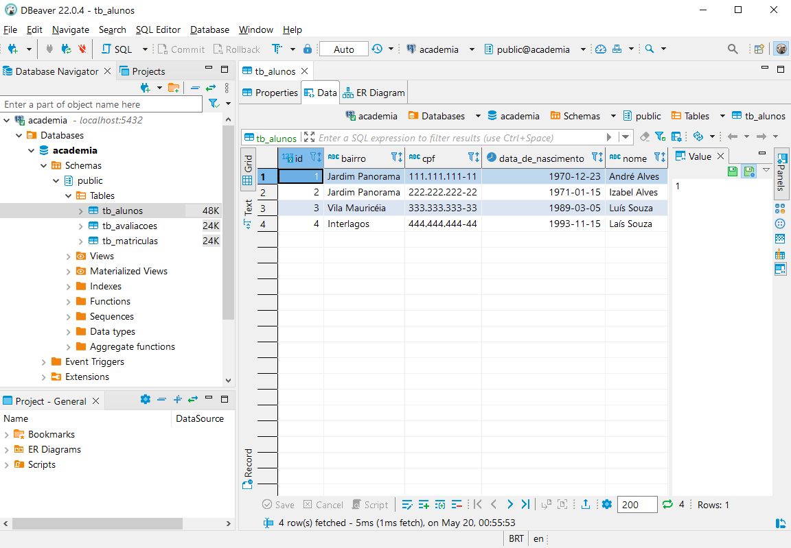
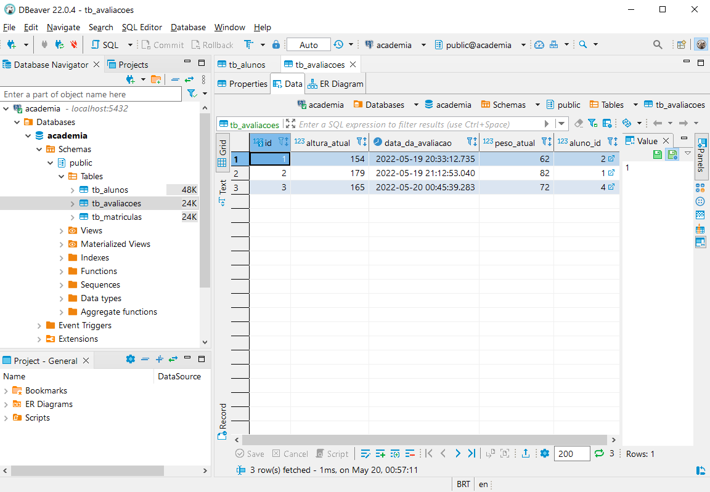

<h1>Conhecendo o Projeto Spring Data JPA na Prática </h1>

 Sejam bem-vindos ao projeto de LAB <strong>Conhecendo o Projeto Spring Data JPA na Prática</strong> oferecido gratuitamente pela plataforma de cursos online <a href="https://dio.me/"><strong> Digital Innovation One</strong></a>. 

<h2>🎯 Objetivo do Projeto</h2>

Ao final deste projeto, o Dev irá conhecer os principais conceitos de mapeamento objeto relacional (ORM) usando o <strong>Spring Data JPA</strong>. Para isso, uma <strong>API RESTful</strong> será desenvolvida com ênfase na modelagem de suas entidades, no domínio de uma academia de ginástica.

<h2>
🛑 Pré-requisitos
</h2>

- [x] Fundamentos do Spring Boot

- [x] Noções de SQL

<h2>🛠 Tecnologias Utilizadas</h2>

<ul>
    <li>IDE IntelliJ</li>
    <li>Java 11</li>
    <li>Maven</li>
    <li><strong>Spring Web</strong></li>
    <li><strong>Spring Data JPA</strong></li>
    <li><strong>PostgreSQL Driver</strong></li>
    <li><strong>Hibernate Validator</strong></li>
    <li>Lombok</li>
    <li>Postman</li>
    <li>DBeaver</li>
</ul>

<h2>🔗 Links Úteis</h2>
<ul>
    <li><a href="https://start.spring.io/#!type=maven-project&language=java&platformVersion=2.6.1&packaging=jar&jvmVersion=11&groupId=me.dio.academia&artifactId=academia-digital&name=academia-digital&description=Tutorial%20API%20RESTful%20modelando%20sistema%20de%20academia%20de%20gin%C3%A1stica&packageName=me.dio.academia.digital&dependencies=web,data-jpa,postgresql,validation,lombok">Spring Initializr</a></li>
    <li><a href="https://docs.spring.io/spring-boot/docs/2.0.x/reference/html/common-application-properties.html">Common application properties</a></li>
    <li><a href="https://docs.spring.io/spring-data/jpa/docs/current/reference/html/#jpa.repositories">Spring Data JPA - Reference Documentation</a></li>
    <li><a href="https://docs.jboss.org/hibernate/stable/validator/reference/en-US/html_single/#validator-gettingstarted">Validation Reference Implementation: Reference Guide</a></li>
    <li><a href="https://strn.com.br/artigos/2018/12/11/todas-as-anota%C3%A7%C3%B5es-do-jpa-anota%C3%A7%C3%B5es-de-mapeamento/"> Anotações de Mapeamento - Referência rápida</a></li>
</ul>

<h2>📷 Imagens de interações com o projeto</h2>

<figure>
    <figcaption>Criação de um registro de aluno</figcaption>
    
</figure>
<figure>
    <figcaption>Consulta de todos os alunos</figcaption>
    
</figure>
<figure>
    <figcaption>Consulta de um aluno pela data de nascimento</figcaption>
    
</figure>
<figure>
    <figcaption>Criação de um registro de avaliação física</figcaption>
    
</figure>
<figure>
    <figcaption>Consulta a todas às avaliações físicas</figcaption>
    
</figure>
<figure>
    <figcaption>Consulta de uma avaliação física pelo id do aluno</figcaption>
    
</figure>
<figure>
    <figcaption>Criação de um registro de matrícula</figcaption>
    
</figure>
<figure>
    <figcaption>Consulta a todas às matrículas</figcaption>
    
</figure>
<figure>
    <figcaption>Consulta de uma matrícula pelo bairro do aluno</figcaption>
    
</figure>
<figure>
    <figcaption>Exibição da tabela tb_alunos</figcaption>
    
</figure>
<figure>
    <figcaption>Exibição da tabela tb_avaliacoes</figcaption>
    
</figure>
<figure>
    <figcaption>Exibição da tabela tb_matriculas</figcaption>
    
</figure>

<h2> 🤝 Projeto Base </h2>

Este projeto foi desenvolvido a partir do seguinte projeto base:

<ul>
    <li><a href="https://github.com/cami-la/academia-digital/releases/tag/v1.0.0">Projeto base</a></li>
</ul>

------------

Instrutora: [cami-la](https://www.linkedin.com/in/cami-la/ "cami-la").

